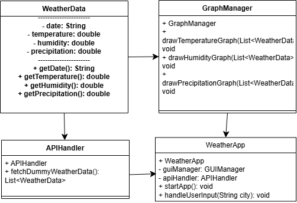

# Weather Data Visualization App 🌦️

A Java-based application that displays and visualizes weather data using a graphical user interface (GUI) and dynamic charts.

---

## 📌 Project Information

- **Project Name:** Weather Data Visualization App  
- **Course:** CSI 2300 - Java Programming  
- **Developer:** Manideep Reddy Thalla  

---

## 💡 Features

- GUI built with Java Swing  
- Fetches and displays weather data (dummy data)  
- Interactive buttons to:
  - 📄 Show Weather (text)
  - 📈 Show Temperature Chart (line chart)
  - 💧 Show Humidity Chart (line chart)
  - 🌧️ Show Precipitation Chart (bar chart)  
- Graphs rendered using [JFreeChart](https://github.com/jfree/jfreechart)

---

## 🗂️ Project Folder Structure

```
Weather-Data-Visualization-App/
├── src/
│   ├── api/
│   ├── data/
│   ├── graph/
│   ├── gui/
│   └── WeatherApp.java
├── lib/
│   ├── jfreechart-1.5.3.jar
│   └── jcommon-1.0.24.jar
├── uml_diagram.png
├── User_Manual_Weather_App.docx
└── Implementation_Manual_Weather_App.docx
```

---

## ⚙️ How to Compile and Run

### 1. Open Terminal or Command Prompt
Navigate to the `src` folder.

### 2. Compile:
```bash
javac -cp ".;../lib/jfreechart-1.5.3.jar;../lib/jcommon-1.0.24.jar" data/*.java api/*.java graph/*.java gui/*.java WeatherApp.java
```

### 3. Run:
```bash
java -cp ".;../lib/jfreechart-1.5.3.jar;../lib/jcommon-1.0.24.jar" WeatherApp
```

*(Use `:` instead of `;` for Mac/Linux.)*

---

## 📸 Demo (Optional)

🎥 You can pre-record a short video of the app in action, upload it to YouTube, and paste the link here!

---

## 🧠 UML Class Diagram



- `WeatherData`: Stores date, temperature, humidity, precipitation
- `APIHandler`: Returns dummy weather data
- `GraphManager`: Creates and displays JFreeChart graphs
- `GUIManager`: Manages Swing-based user interface
- `WeatherApp`: Launches the application

---

## 📎 Manuals

- 📘 [User Manual](User_Manual_Weather_App.docx)  
- 🛠️ [Implementation Manual](Implementation_Manual_Weather_App.docx)

---

## ✅ License

This project is for educational use only – CSI 2300 course at Oakland University.
