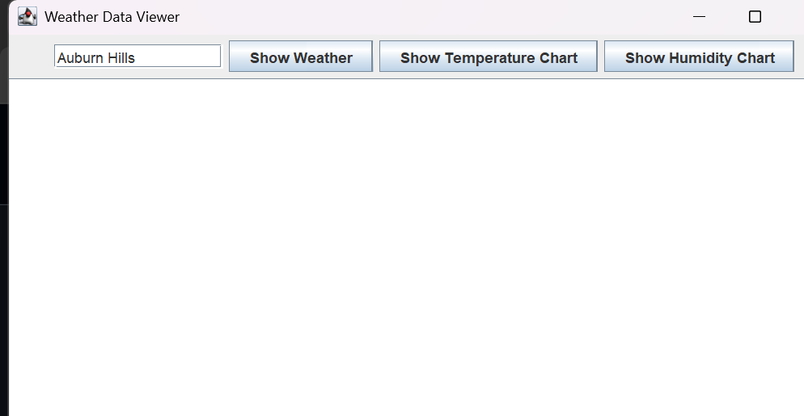
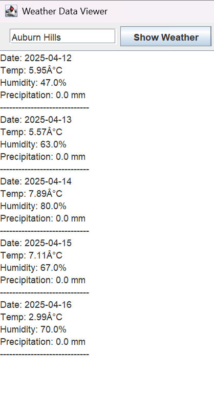
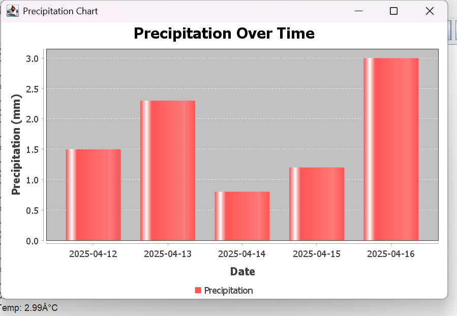

# 🌦️ Weather Data Visualization App

A Java GUI-based desktop application that fetches and visualizes 5-day weather forecast data for any city. It displays temperature, humidity, and precipitation charts using JFreeChart and includes a demo mode to simulate data for presentation purposes.

---

## 🛠️ Features

- 🔍 Search weather for any city using a text input
- 🌡️ Visualize **Temperature**, **Humidity**, and **Precipitation** using bar charts
- 🔄 Retrieves **real-time data** from the [OpenWeatherMap API](https://openweathermap.org/)
- 🎯 Includes a **Demo Chart Mode** with sample precipitation data
- 🖥️ GUI built using **Java Swing**
- 📊 Graphs rendered using **JFreeChart**
- 📂 Clean modular structure (data, api, gui, graph)
- ✅ Fully documented and easy to extend

---

## 📸 Screenshots

> ℹ️ Save your screenshots in a `screenshots/` folder inside the repo.

### 📍 Main Application Interface


### 🧾 Real-time Weather Output


### 🌧️ Precipitation Chart (Demo)


---

## 🚀 How to Compile and Run

1. **Download or clone** the repository:
```
git clone https://github.com/yourusername/Weather-Data-Visualization-App.git
cd Weather-Data-Visualization-App/src
```

2. **Compile the source code** (requires Java 11+):
```bash
javac -cp ".;../lib/*" data/*.java api/*.java graph/*.java gui/*.java WeatherApp.java
```

3. **Run the application**:
```bash
java -cp ".;../lib/*" WeatherApp
```

✅ Make sure the `lib` folder contains:
- `jfreechart-1.5.3.jar`
- `jcommon-1.0.24.jar`
- `json-20230227.jar`

---

## 🧠 How to Use

1. Launch the app using the run command above.
2. Enter the name of any city (e.g., `Auburn Hills`).
3. Click:
   - **Show Weather** → to view 5-day forecast
   - **Show Temperature Chart** → temperature trends
   - **Show Humidity Chart** → humidity levels
   - **Show Precipitation Chart** → rainfall data
   - **Demo Precipitation Chart** → simulate rain for visual testing

---

## 📁 Project Structure

```
src/
├── WeatherApp.java                 # Main launcher class
├── data/
│   └── WeatherData.java            # Model class
├── api/
│   └── APIHandler.java             # Handles API requests
├── graph/
│   └── GraphManager.java           # Displays JFreeChart graphs
├── gui/
│   └── GUIManager.java             # Manages GUI layout and buttons
lib/
├── jfreechart-1.5.3.jar
├── jcommon-1.0.24.jar
├── json-20230227.jar
screenshots/
├── main_gui.png
├── weather_output.png
├── precip_demo.png
```

---

## 💡 Future Improvements (Optional Ideas)

- Add Fahrenheit/Celsius toggle
- Export charts as PNG
- Schedule automatic weather refresh
- Extend to mobile using JavaFX

---

## 👨‍🏫 Author Info

**Manideep Reddy Thalla**  
Student, Oakland University  
Course: CSI 2300 - Object-Oriented Computing  
Semester: Spring 2025  
Project Type: Solo  
Presentation Date: April 17, 2025

---

## 📜 License

This project is for educational use only under the CSI 2300 course guidelines.